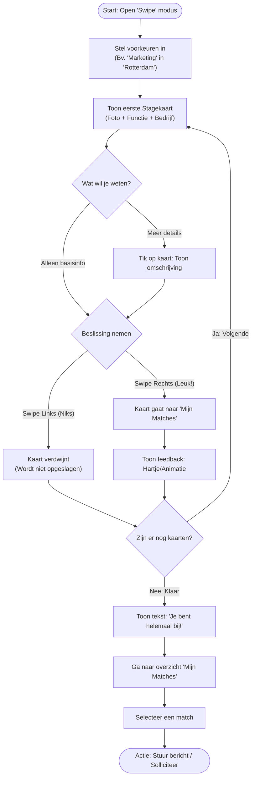

# Overzicht
De app is een "Tinder" style app waarbij studenten die op zoek zijn naar een stageplek en bedrijven die stagaires zoeken kunnen "swipen" om met elkaar te matchen. Dit zou een laagdrempelige manier moeten zijn om stagaires en bedrijven te verbinden en tot een betere match te kunnen komen.

# Studenten Flow
